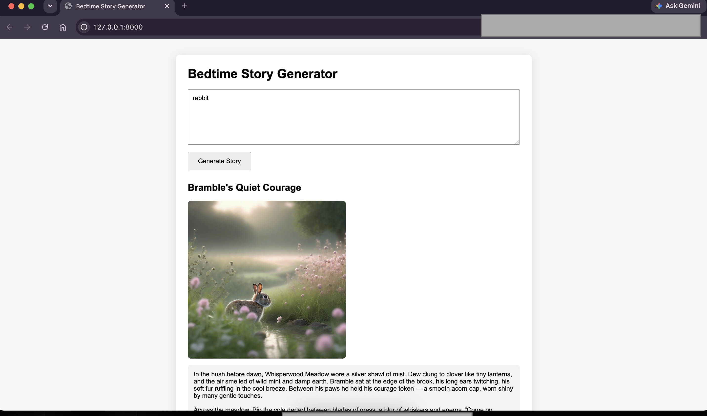

# Bedtime Story Agent

An agentic AI application that creates illustrated bedtime stories using LLM function calling.



## Features

- Optimize story prompts
- Generate story outline
- Write complete children's stories
- Extract the best scene for illustration
- Generate an image
- Save the story and image as a Markdown file

## Installation

Clone the repository and install the dependencies.

```bash
uv sync
```

## Configuration

Copy the example environment file.

```bash
cp .env.example .env
```

Update the values inside `.env`.

## Run

```bash
uv run fastapi dev
```

## Output

Generated stories are saved inside the `outputs/` directory.

## Requirements

- Python 3.11+
- OpenAI-compatible API